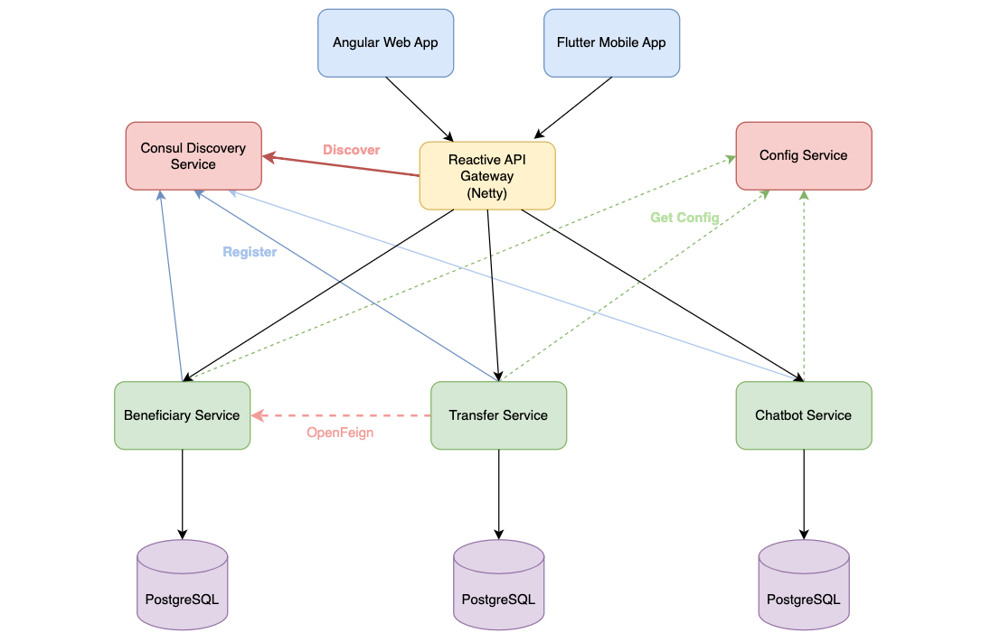
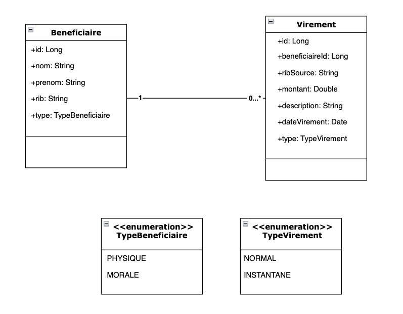
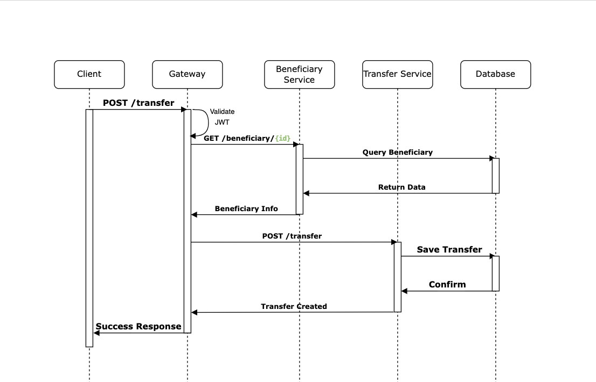

# Banking Microservices Project

## 🏦 Project Overview

This is a Proof of Concept (POC) for a banking application based on a microservices architecture, developed using Spring Boot and Spring Cloud.

### 🎯 Project Objectives

- Manage bank beneficiaries
- Perform banking transfers
- Integrate an AI-powered chatbot for customer support

## 🔧 Technologies Used

### Backend
- Spring Boot
- Spring Cloud
- Spring OpenFeign
- Eureka Discovery
- Spring Cloud Gateway
- OpenAPI/Swagger

### Frontend
- React (Web)
- Flutter (Mobile)

### Infrastructure
- Docker
- Kubernetes
- Jenkins

## 🏗️ System Architecture

### Global Architecture



### Design Diagrams

#### Class Diagram



#### Sequence Diagram (Transfer Example)



## 🗂️ Project Structure

```
├── beneficiary-service/
├── transfer-service/
├── chatbot-service/
├── gateway-service/
├── discovery-service/
└── config-service/
```

## 📦 Microservices

### 1. Beneficiary Service
- Manage beneficiary information
- CRUD operations on beneficiaries
- RIB (Bank Account) validation

### 2. Transfer Service
- Manage bank transfers
- Communication with Beneficiary Service
- Transaction validation

### 3. Chatbot Service
- Generative AI
- RAG (Retrieval Augmented Generation) system
- AI-powered customer support based on PDF documents

### 4. Technical Services
- Gateway Service (Reactive Gateway)
- Discovery Service (Consul)
- Configuration Service

## 🚀 Installation and Setup

### Prerequisites
- Java 17+
- Maven
- Docker
- Kubernetes (optional)

### Installation Steps

1. Clone the repository
```bash
git clone https://github.com/Hamhamdi/digital-banking-ms.git
```

2. Compile the project
```bash
mvn clean install
```

3. Start the services
```bash
docker-compose up
```

## 📝 API Documentation

- Swagger UI available on each service
- Complete OpenAPI documentation

## 🤝 Contribution

1. Fork the project
2. Create a feature branch
3. Commit your changes
4. Push and open a Pull Request


## Contact
Hamza Hamdi
  h_hamdi@etu.enset-media.ac.ma


